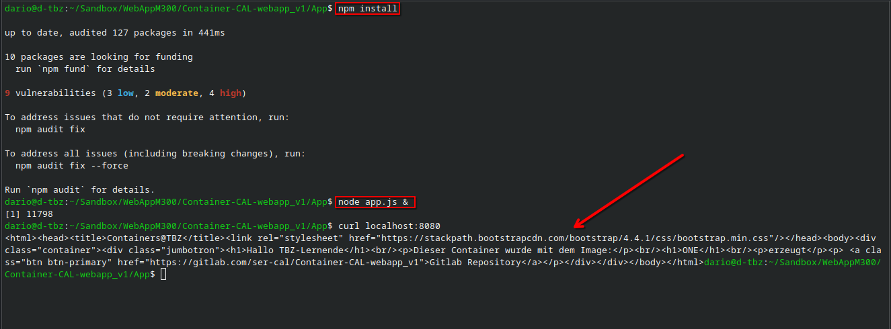
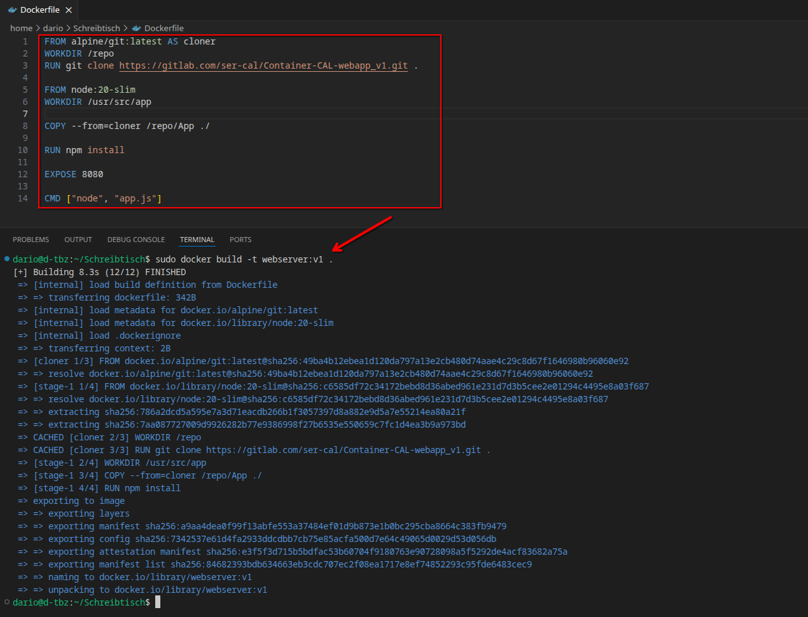
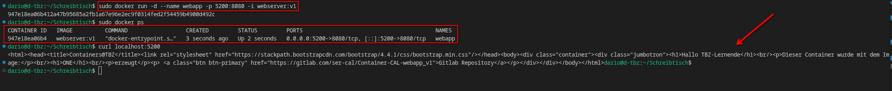

# Hands-on Übungen

 

### Web-App ohne Container

Als erstes clone ich das Repository und installiere die Pakete mit `npm install`. Danach starte ich die App mit `node app.js &` als Prozess und teste ob ich mich zur App verbinden kann.  

 

### Web-App mit Container

Ich lasse mir eine Dockerfile generieren und ändere die Werte so, dass das Image gebaut werden kann. Für solche "kleinen" Aufgaben, wenn das Verständnis schon da ist, ist KI etwas sehr praktisches. 

 

Dann starte ich einen Container mit dem gebauten Image auf lokalem Port 5200. Danach rufe ich die Seite auf und man sieht, dass der Container antwortet. 

 

### Linux Namespaces

Ein Namespace mit isoliertem Netzwerk und Prozessen wird mit dem folgenden Befehl erstellt. 

`sudo unshare -n  -p --fork  --mount-proc sh`

Die `--fork` Flag erstellt einen Child Prozess, damit die PID Isolierung technisch möglich ist. Die `--mount-proc` Flag mountet einen neuen `/proc` Ordner, weil `ps` sonst vom Host System die Prozesse listen würde. 

 

Innerhalb des Namespaces ist es nicht möglich jegliche Netzwerke zu pingen, da mit der `-n` Flag das Netzwerk isoliert wurde. Logischerweise sind keine Netzwerkadapter verfügbar, ausser Loopback. Man sieht, dass mit dem letzten Befehl nur ein Prozesse gelistet wird, und zwar den eben ausgeführten Befehl. 

 

### Docker Hub Limits

Hier geht es um das "Pull Rate Limit", welches für verschiedene Arten von User Accounts zählt. 

| User Typ                 | Pull Rate Limit für 6 Stunden | Anzahl öffentliche Repositories | Anzahl private Repositories |
| ------------------------ | ----------------------------- | ------------------------------- | --------------------------- |
| Business (authenticated) | Unlimited                     | Unlimited                       | Unlimited                   |
| Team (authenticated)     | Unlimited                     | Unlimited                       | Unlimited                   |
| Pro (authenticated)      | Unlimited                     | Unlimited                       | Unlimited                   |
| Personal (authenticated) | 200                           | Unlimited                       | Up to 1                     |
| Unauthenticated users    | 100                           | -                               | -                           |

Beispielsweise kann ein User mit Gratis Account, also Personal, jede 6 Stunden maximal 200 Pull Requests senden. 