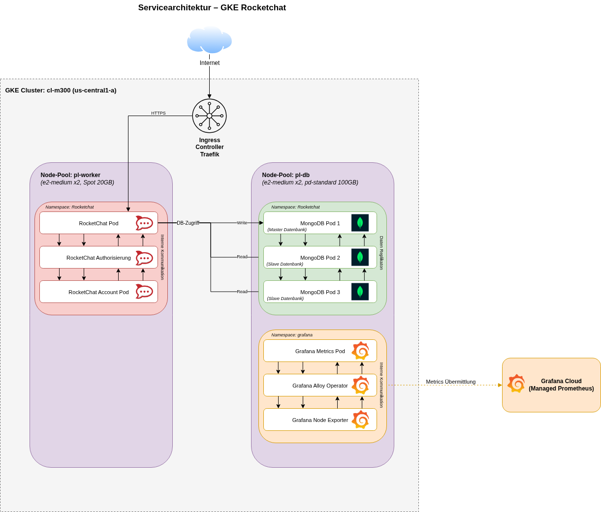

# Planung

## Arbeitsschritte

 

### Definierte Arbeitsschritte

Arbeitsschritte, die anfangs definiert und chronologisch durchgeführt werden. 

| ID  | Schritt                              | Beschreibung                                                                                                                                                                                                                                                                                      |
| --- | ------------------------------------ | ------------------------------------------------------------------------------------------------------------------------------------------------------------------------------------------------------------------------------------------------------------------------------------------------- |
| 1   | Nutzung der Images verstehen         | Saelor, die Open Source Lösung, bietet in der Dokumentation eine Anleitung wie man die E-Commerce Plattform lokal hostet. Es gilt diese zu verstehen, damit das gegebene Docker Compose File zu einem oder mehreren Deployments, welches für Kubernetes benötigt werden, umgewandelt werden kann. |
| 2   | Einrichtung & Einlesung Google Cloud | Grundlegendes Setup von Google Cloud. Verstehen der Google Kubernetes Engine.                                                                                                                                                                                                                     |
| 3   | Entwurf Deployments                  | Entwerfen der benötigten Deployments und testen des Deploy Prozesses. Fehleranalyse und Überarbeitung der Deployments.                                                                                                                                                                            |
| 4   | Finales optimiertes Deployment       | Finales Deployen aller Services. Testen der Funktionalität und Behebung der Fehler. Optimieren des Deployments.                                                                                                                                                                                   |

 

### Laufende Arbeitsschritte

Arbeitsschritte, die während des ganzen Projekts regelmässig durchzuführen sind. 

| ID  | Schritt        | Beschreibung                                                   |
| --- | -------------- | -------------------------------------------------------------- |
| 1   | Journal führen | Beschreiben der durchgeführten Arbeit                          |
| 2   | Dokumentieren  | Sauberes & nachvollziehbares Dokumentieren der Arbeitsschritte |

 

Die Arbeitsschritte können und werden sich höchstwahrscheinlich im Verlauf des Projekts ändern. 

 

## Servicearchitektur

 

### Diagramm

