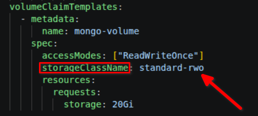
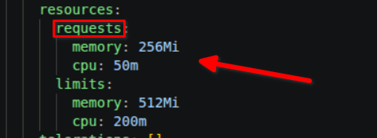
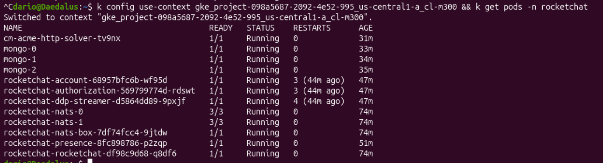
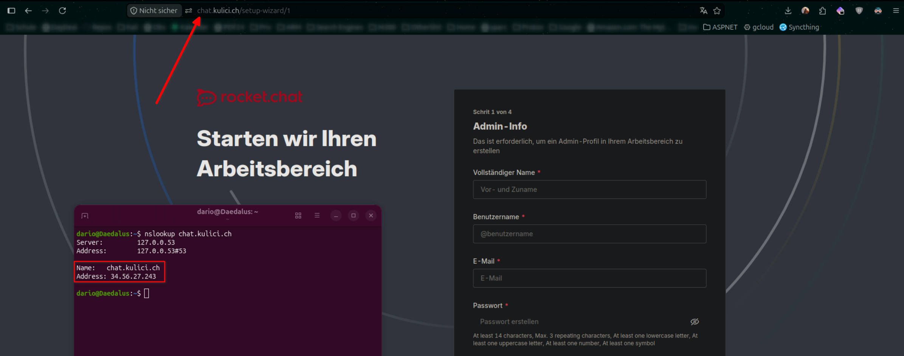
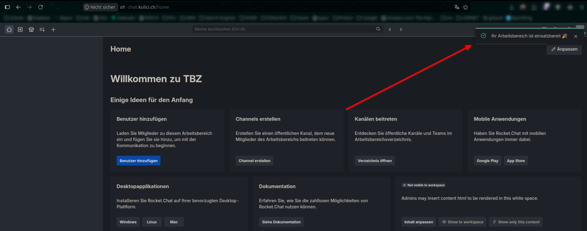
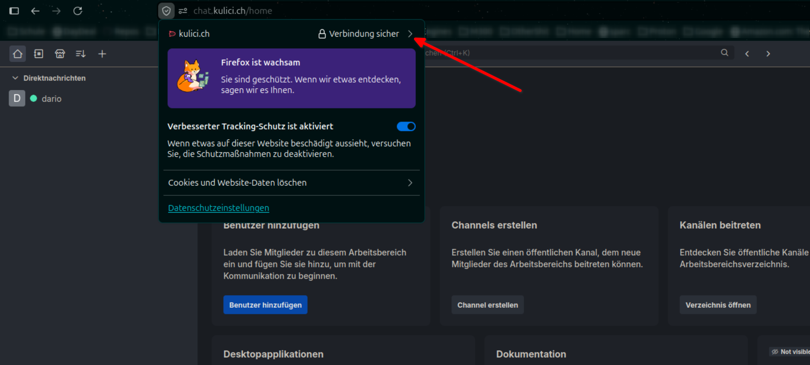
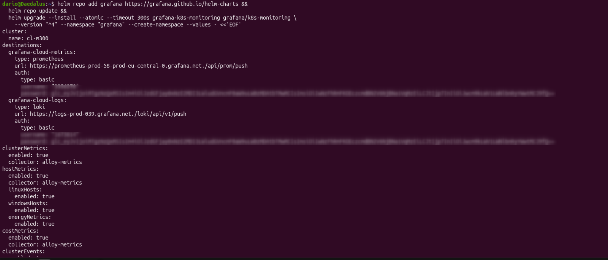
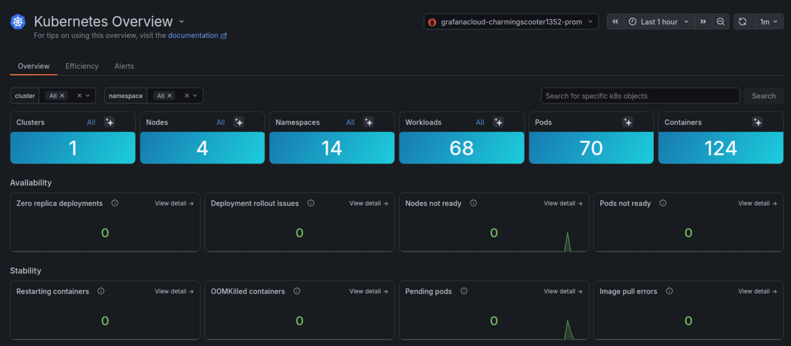

# Cloud Deployment

## Vorbereitung

Um das Deployment so einfach wie möglich zu gestalten, erfasse ich alle benötigten Befehle in ein [Skript](../Projektdateien/Deploy/deploy.sh). Das Skript richtet die Datenbank automatisch ein und fragt Secrets über das Terminal ab, sodass ich das Skript auf das Repository pushen kann. 

 

## Manifest-Anpassungen

### Storage Class

Google Cloud hat andere Storage Klassen, um Volumen zu erstellen, daher passte ich die Storage Class von `standard` auf `standard-rwx` an. 

 

### Ressource Requests

Lokal sind, in diesem spezifischen Fall, viel mehr Ressourcen nutzbar im Vergleich  zur Cloud. Wenn zu viel Ressourcen angefragt werde, fängt der Provisioner an Pods zu killen. Dies ergibt einen Crash Loop, weil das Manifest besagt es müssen eine definierte Anzahl an Replicas laufen während der Provisioner die neuen Pods direkt killt. Daher passte ich die Requests so an, dass keine Crash Loops entstanden. 

 

## Deployment

Im unteren Bild erkennt man die laufenden Pods auf dem Cluster. 

 

Der Service ist auf der Public IP des Clusters erreichbar. 

 

Nun ist der Server registriert. 

 

Nach dem neuen Ausrollen der Cert Manager Manifeste ist die Webseite durch ein Lets Encrypt Zertifikat gesichert. 

## Monitoring

Der Agent wird über einen vorgefertigten Deploy Befehl direkt auf dem Cluster deployed. 

 

Auf dem Dashboard werden die Metrics des Clusters sauber angezeigt. 

 

