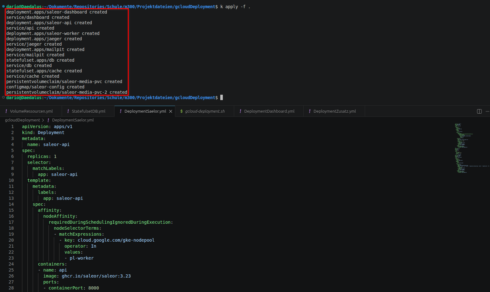
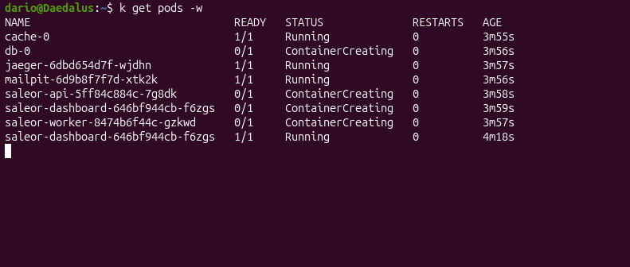
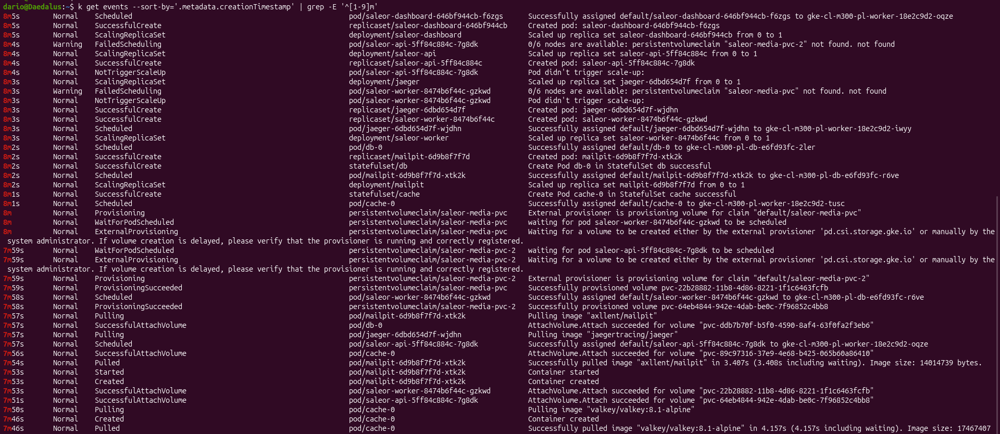

# Deployment der Services

## Deployment Testing Loop

Im folgenden Bild wird das Deployment der definierten Services durchgeführt. Ich habe einen Alias für `kubectl` erstellt, damit ich nicht jedes Mal das ganze Wort ausschreiben muss, sondern lediglich `k` schreiben kann. 

 

Danach prüfe ich den Status der Pods. Man sieht, dass einige Container noch in der Erstellung sind. Die `-w` Flag steht für `--watch` und aktualisiert live den Befehl. 

 

Um zu sehen was genau im Cluster passiert liste ich die Events auf, sortiert nach Minuten und schaue für den Event Typ "Warning". Eine Warnung enthält den Fehler "Failed Scheduling" und weiter rechts sieht man den Grund. Ein definierter Persistent Volume Claim existiert anscheinend nicht zum Zeitpunkt der Erstellung des Saleor Worker Deployments. 

 

Nun schaue ich Fehlermeldung an, überlege, warum sie auftauchen und passe die Deployments laufend an. Danach wiederholt sich der obige Loop, bis alles funktioniert. 