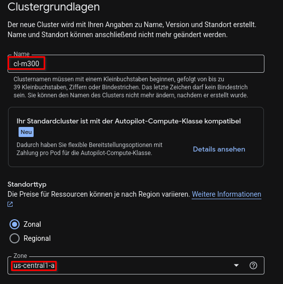
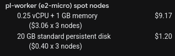
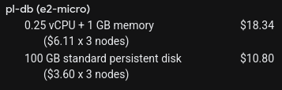
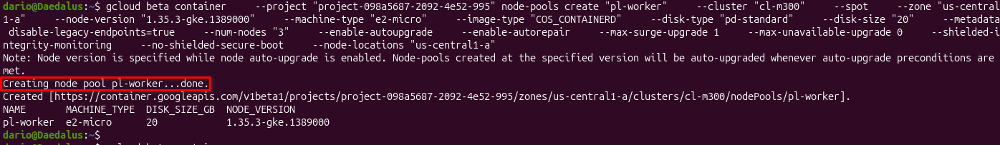
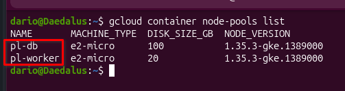
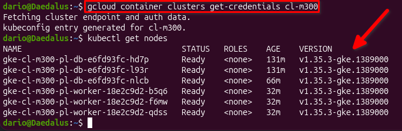

# Google Cloud Einrichtung

## Cluster

Das Cluster kann zonal oder regional erstellt werden. Regional ist teurer, weil das Cluster in mehrere Zonen deployed wird. Damit die Umgebung nicht das Gratis Budget übergeht wähle ich ausschliesslich die Zone `us-central1-a`. 



<br>

## Node Pools

Der Node Pool ist eine Gruppierung, die Nodes enthält, auf denen die Pods laufen werden. Die Nodes in einem Node Pool haben alle dieselbe Konfiguration, z.B OS Version. 

### Worker Node Pool

Auf diesem Node Pool sollen Worker laufen. Diese halten selbst keine Daten sondern verarbeiten sie lediglich. 

| Einstellung         | Wert                                   |
| ------------------- | -------------------------------------- |
| Leistungstyp        | e2-micro (2 vCPU, 1 core, 1 GB memory) |
| Speicher (GB)       | 20                                     |
| Provisioning Modell | Spot VMs                               |
| Upgrade Strategie   | Surge upgrade                          |
| Anzahl Nodes        | 3                                      |

Das Provisioning Modell legt fest, was für VMs verwendet werden. Spot VMs sind billiger, dafür weniger ausfallsicher. Standard VMs wären ausfallsicher, allerdings teurer. Da keine Daten auf diesem Node Pool gespeichert werden, wähle ich Spot VMs, um die Kosten tief zu halten. 



Die Gesamtkosten dieses Node Pools betragen 10.37$ im Monat. 

<br>

### Datenbank Node Pool

Hier soll das Datenbank Cluster laufen, auf dem Daten der Applikation gespeichert werden. 

| Einstellung         | Wert                                   |
| ------------------- | -------------------------------------- |
| Leistungstyp        | e2-micro (2 vCPU, 1 core, 1 GB memory) |
| Speicher (GB)       | 100                                    |
| Provisioning Modell | Standard VMs                           |
| Upgrade Strategie   | Surge upgrade                          |

Hier wähle ich Standard VMs als Provisioning Modell. Dadurch sind die Daten am besten geschützt. 



Die Gesamtkosten dieses Node Pools betragen 29.14$ im Monat. 

<br>

## Deployment über Cloud Shell

Nach dem konfigurieren des Clusters exportiere ich die Deploy Commands. 

```bash

gcloud beta container \
    --project \
"project-098a5687-2092-4e52-995" clusters create "cl-m300" \
    --zone \
"us-central1-a" \
    --no-enable-basic-auth \
    --cluster-version \
"1.35.3-gke.1389000" \
    --release-channel \
"regular" \
    --machine-type \
"e2-micro" \
    --image-type \
"COS_CONTAINERD" \
    --disk-type \
"pd-standard" \
    --disk-size \
"20" \
    --metadata \
disable-legacy-endpoints=true \
    --spot \
    --num-nodes \
"1" \
    --logging=SYSTEM,WORKLOAD \
    --monitoring=SYSTEM,STORAGE,POD,DEPLOYMENT,STATEFULSET,DAEMONSET,HPA,JOBSET,CADVISOR,KUBELET,DCGM \
    --enable-ip-alias \
    --network \
"projects/project-098a5687-2092-4e52-995/global/networks/default" \
    --subnetwork \
"projects/project-098a5687-2092-4e52-995/regions/us-central1/subnetworks/default" \
    --cluster-ipv4-cidr \
"/17" \
    --no-enable-intra-node-visibility \
    --default-max-pods-per-node \
"110" \
    --enable-ip-access \
    --security-posture=standard \
    --workload-vulnerability-scanning=disabled \
    --no-enable-google-cloud-access \
    --addons \
HorizontalPodAutoscaling,HttpLoadBalancing,NodeLocalDNS,GcePersistentDiskCsiDriver \
    --enable-autoupgrade \
    --enable-autorepair \
    --max-surge-upgrade \
1 \
    --max-unavailable-upgrade \
0 \
    --binauthz-evaluation-mode=DISABLED \
    --enable-managed-prometheus \
    --enable-shielded-nodes \
    --shielded-integrity-monitoring \
    --no-shielded-secure-boot \
    --node-locations \
"us-central1-a" \
&& \
gcloud beta container \
    --project \
"project-098a5687-2092-4e52-995" node-pools create "pl-db" \
    --cluster \
"cl-m300" \
    --zone \
"us-central1-a" \
    --node-version \
"1.35.3-gke.1389000" \
    --machine-type \
"e2-micro" \
    --image-type \
"COS_CONTAINERD" \
    --disk-type \
"pd-standard" \
    --disk-size \
"100" \
    --metadata \
disable-legacy-endpoints=true \
    --num-nodes \
"3" \
    --enable-autoupgrade \
    --enable-autorepair \
    --max-surge-upgrade \
1 \
    --max-unavailable-upgrade \
0 \
    --shielded-integrity-monitoring \
    --no-shielded-secure-boot \
    --node-locations \
"us-central1-a" \
&& \
gcloud beta container \
    --project \
"project-098a5687-2092-4e52-995" node-pools create "pl-worker" \
    --cluster \
"cl-m300" \
    --spot \
    --zone \
"us-central1-a" \
    --node-version \
"1.35.3-gke.1389000" \
    --machine-type \
"e2-micro" \
    --image-type \
"COS_CONTAINERD" \
    --disk-type \
"pd-standard" \
    --disk-size \
"20" \
    --metadata \
disable-legacy-endpoints=true \
    --num-nodes \
"3" \
    --enable-autoupgrade \
    --enable-autorepair \
    --max-surge-upgrade \
1 \
    --max-unavailable-upgrade \
0 \
    --shielded-integrity-monitoring \
    --no-shielded-secure-boot \
    --node-locations \
"us-central1-a" \
&& \
gcloud beta container
    --project \
"project-098a5687-2092-4e52-995" node-pools delete default-pool \
    --cluster "cl-m300" \
    --zone "us-central1-a" \
    --quiet

```

<br>

Der Default Pool wird leider automatisch erstellt, weshalb dieser am Ende des Skripts einfach wieder gelöscht wird. 

<br>

Im unten stehenden Bild erkennt man, wie der `pl-worker` Pool erstellt wurde. 



<br>

Somit sind die Pools erstellt worden und können wenn nötig ohne viel Aufwand einfach wieder deployed werden. 



<br>

## kubectl Config

Zum Schluss lade ich die kubectl Konfiguration, um auf das Cluster zugreifen zu können. 



<br>

