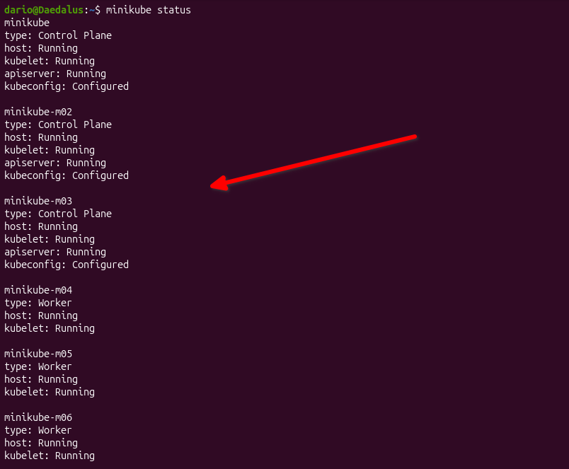
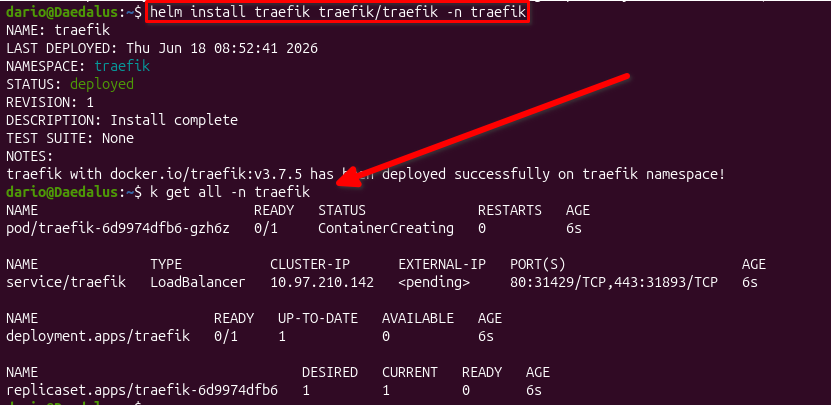
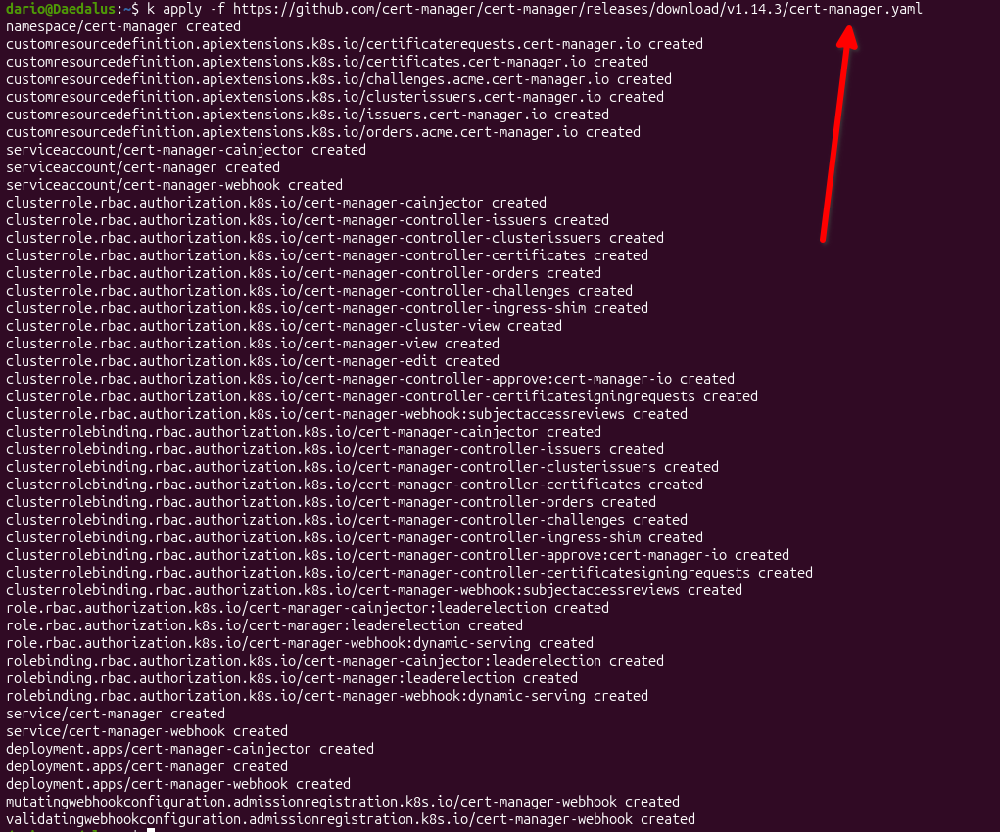
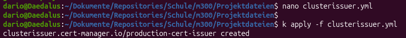
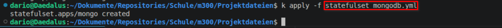
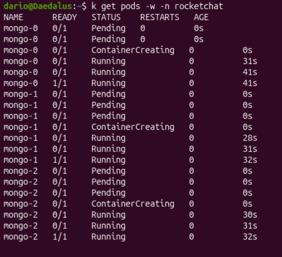
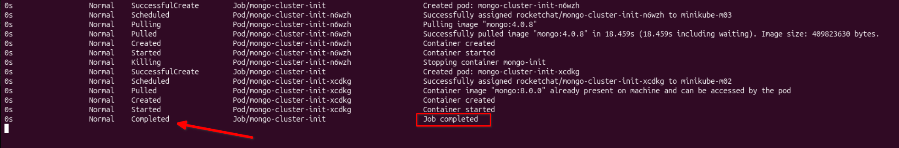
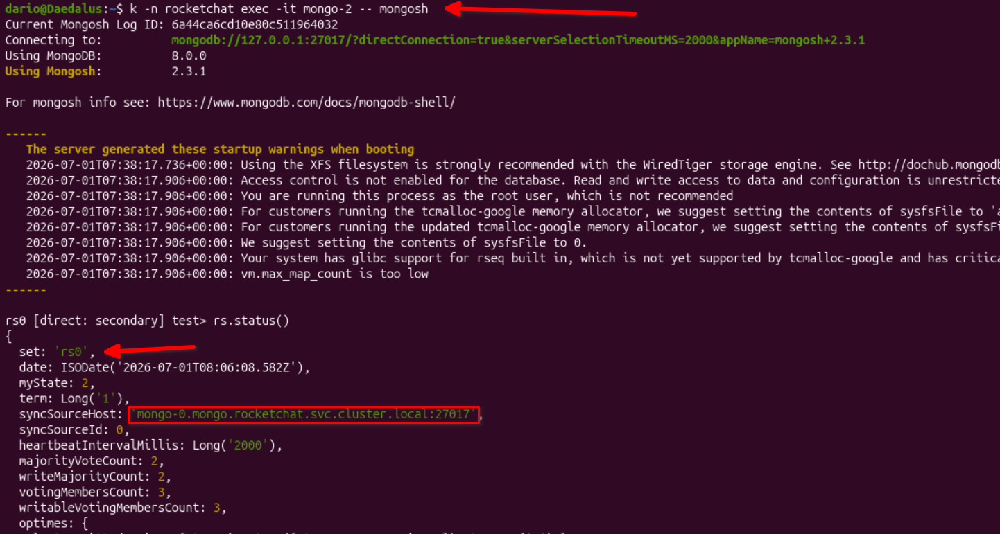

# Lokales Deployment

Bevor der Applikation Stack auf der Cloud deployed wird, teste ich es auf der lokalen Umgebung, um allfällige Problematiken schneller lösen zu können. Mit `minikube` wird dies ermöglicht. 

## Minikube

Minikube startet lokal ein Kubernetes Cluster basierend, spezifisch in diesem Fall, auf `kvm2`, welches schnell bereit ist um direkt Deployments zu testen. 

 

## Deployment 

Jeder Service wird nun deployed und auf allfällige Problematiken getestet. 

### Traefik

Traefik ist ein Ingress Controller, der zuständig für das Routing und Load Balancing sein wird. 

 

### Cert Manager

Für die Verwendung von HTTPS wird ein Certification Manager benötigt, um ein Lets Encrypt Zertifikat zu beantragen. 

 

Im Cluster Issuer File sind die benötigten persönlichen Angaben erfasst. 

 

### MongoDB Cluster

Das Mongo DB Cluster wird zur Speicherung der Daten, der Chat Plattform verwendet. Gleichzeitig ist das Cluster hoch verfügbar, da die Datenbanken sich replizieren. 

 

Nach wenigen Momenten wechseln die Pods auf `Running` und sind somit bereit. 

 

### Automatischer Init Job fürs Mongo Cluster

Die Datenbanken sind zwar am laufen, bilden allerdings noch kein Cluster. Daher muss ein Job deployed werden, der die Initialisierung des Clusters durchführt. 

 

Der Job wird gestartet und löscht sich nach dem Ausführen des Jobs. 

 
Zur Kontrolle stelle ich eine Verbindung zu einem Datenbank Pod auf und prüfe den Status des Clusters mit `rs.status()`. Auf dem unteren Bild sieht man, dass das Cluster erfolgreich initialisiert wurde. 

 

