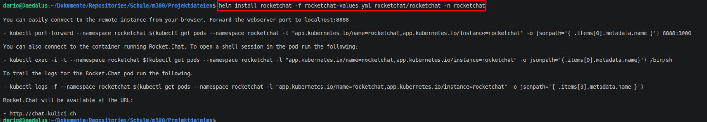
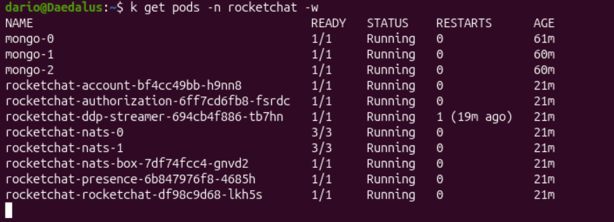
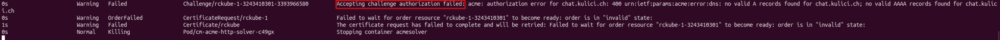
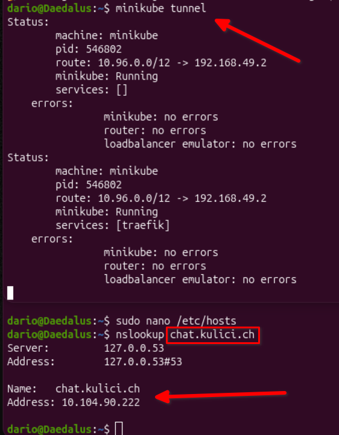
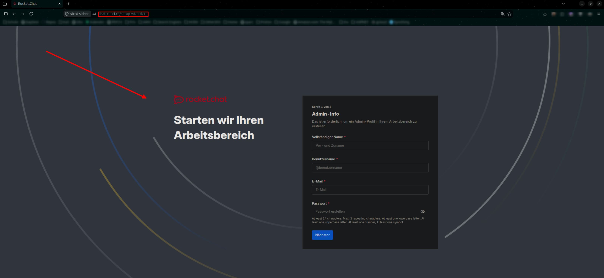

# Lokales Deployment

Bevor der Applikation Stack auf der Cloud deployed wird, teste ich es auf der lokalen Umgebung, um allfällige Problematiken schneller lösen zu können. Mit `minikube` wird dies ermöglicht. 

## Minikube

Minikube startet lokal ein Kubernetes Cluster basierend, spezifisch in diesem Fall, auf `kvm2`, welches schnell bereit ist um direkt Deployments zu testen. 


<br>

## Deployment 

Jeder Service wird nun deployed und auf allfällige Problematiken getestet. 

### Traefik

Traefik ist ein Ingress Controller, der zuständig für das Routing und Load Balancing sein wird. 


<br>

### Cert Manager

Für die Verwendung von HTTPS wird ein Certification Manager benötigt, um ein Lets Encrypt Zertifikat zu beantragen. 


<br>

Im Cluster Issuer File sind die benötigten persönlichen Angaben erfasst. 


<br>

### MongoDB Cluster

Das Mongo DB Cluster wird zur Speicherung der Daten, der Chat Plattform verwendet. Gleichzeitig ist das Cluster hoch verfügbar, da die Datenbanken sich replizieren. 


<br>

Nach wenigen Momenten wechseln die Pods auf `Running` und sind somit bereit. 


<br>

### Initialisieren des Mongo Clusters

Die Datenbanken sind zwar am laufen, bilden allerdings noch kein Cluster. Daher muss ein Job deployed werden, der die Initialisierung des Clusters durchführt. Das Erstellen des Clusters funktioniert über den folgenden Befehl: 

```js
rs.initiate(
   {
      _id: "rs0",
      version: 1,
      members: [
	      { _id: 0, host: "mongo-0.mongo.rocketchat.svc.cluster.local:27017", priority: 2 },
	      { _id: 1, host: "mongo-1.mongo.rocketchat.svc.cluster.local:27017", priority: 1 },
	      { _id: 2, host: "mongo-2.mongo.rocketchat.svc.cluster.local:27017", priority: 1 }
      ]
   }
)
```

<br>

Ich verbinde mich auf die primäre Datenbank (`mongo-0`) und führe den oberen Befehl aus, um das Cluster zu initialisieren. 

<br>

Zur Kontrolle stelle ich eine Verbindung zu einem Datenbank Pod auf und prüfe den Status des Clusters mit `rs.status()`. Auf dem unteren Bild sieht man, dass das Cluster erfolgreich initialisiert wurde. 


<br>

### Rocketchat

Rocketchat ist eine Chat Applikation, auf der Nachrichten, Bilder, Videos oder andere Dateien versendet werden können. 

<br>

Auf dem nächsten Bild sieht man, dass Deployment mit einer personalisierten `rocketchat-values.yml` File. 



<br>

Die Pods starten nach kurzer Zeit und sind betriebsbereit. 



<br>

Die Prüfung des Lets Encrypt Zertifikats schlägt fehl, da ich zum Testen einen Eintrag in der `Hosts` File gemacht habe und die Domain eigentlich gar keine Records enthält. 



<br>

Um das Frontend zu erreichen muss ein Tunnel eingerichtet werden. Auf dem nächsten Bild sind zwei Terminal Fenster übereinander gestapelt, um in einem Bild den Tunnel und die DNS Funktionalität aufzuweisen. 




<br>

Die Applikation ist unter der definierten Domain erreichbar. 



<br>

Der nächste Schritt ist das Deployment in die Cloud zu bringen --> [Cloud Deployment](cloud_deployment.md). 