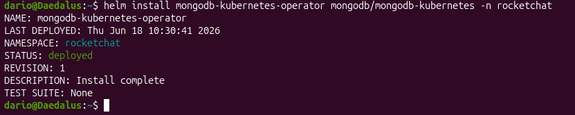

# Lokales Deployment

Bevor der Applikation Stack auf der Cloud deployed wird, teste ich es auf der lokalen Umgebung. Mit `minikube` wird dies ermöglicht. 

### Minikube

Minikube startet lokal ein Kubernetes Cluster basierend, spezifisch in diesem Fall, auf `kvm2`, welches schnell bereit ist um direkt Deployments zu testen. 

 

### Deployment 

Jeder Service wird nun deployed und auf allfällige Problematiken getestet. 

#### Traefik

Traefik ist ein Ingress Controller, der zuständig für das Routing und Load Balancing sein wird. 

 

#### Cert Manager

Für die Verwendung von HTTPS wird ein Certification Manager benötigt, um ein Lets Encrypt Zertifikat zu beantragen. 

 

Im Cluster Issuer File sind die benötigten persönlichen Angaben erfasst. 

 

#### MongoDB Cluster

Das Mongo DB Cluster wird zur Speicherung der Daten, der Chat Plattform verwendet. Gleichzeitig ist das Cluster hoch verfügbar, da die Datenbanken sich replizieren. 

##### MongoDB Operator

Der Operator managed Kubernetes Komponenten für das MongoDB Cluster. 

##### MongoDB Datenbanken

 

