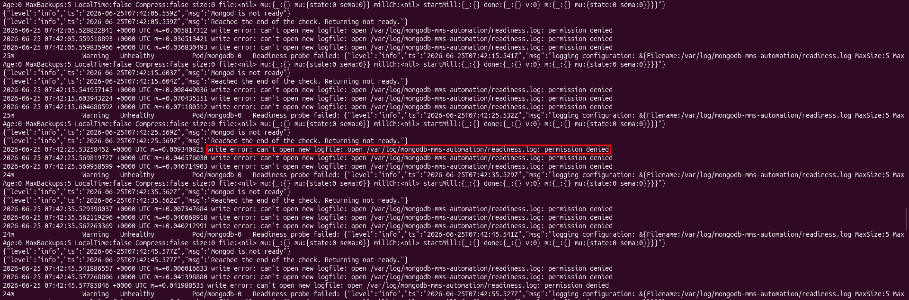
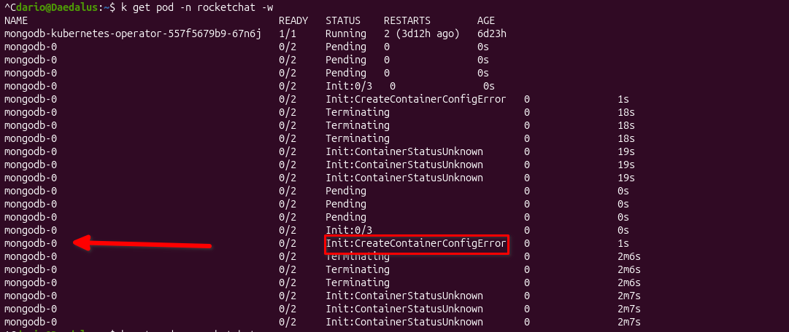

# Fehler beim Deployen des MongoDB Clusters

## Problem

Der erste MongoDB Pod von drei startet ohne Probleme. Beim zweiten wird konstant die Fehlermeldung geworfen, dass der Pod keine Berechtigung hat, um auf den Pfad `/var/log/mongodb-mms-automation/readiness.log` zu schreiben. 

Die Abhängigkeit liegt beim MongoDB Operator. Aus irgendeinem Grund kann ab dem zweiten Pod nicht auf den Pfad geschrieben werden. 

 

Der Pod Status bleibt bei `Init:CreateContainerConfigError`hängen und bleibt so bis zur Löschung. 

 

## Lösungsansatz

Um das Problem zu lösen habe ich mich ausgiebig über MongoDB informiert. Es gibt eine Möglichkeit ein Cluster **ohne** einen MongoDB Operator zu deployen. In diesem [YouTube Video](https://www.youtube.com/watch?v=eUa-IDPGL-Q) wird diese Methode gezeigt. Somit kann die Problem Quelle ausgemerzt werden und das gleiche Resultat über einen besseren Weg erreicht werden. 